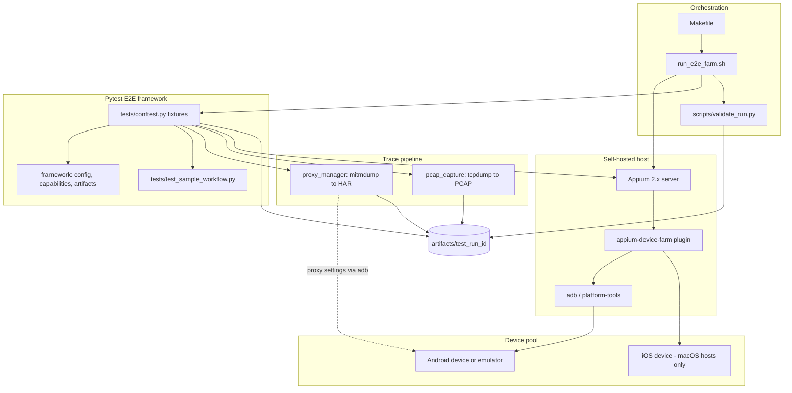

# Self-Hosted Mobile Device Farm + E2E Test Scaffold

A self-contained scaffold for running Appium-based end-to-end tests against a
self-hosted pool of Android (and, on macOS, iOS) devices, with per-session
network interception (HAR) and packet capture (PCAP).

> **Scope note.** This directory is a scaffold/design deliverable. Every
> hardware-dependent code path (adb, Appium, mitmdump, tcpdump) is
> feature-flagged and degrades gracefully: modules import, tests collect, and
> the orchestration entrypoint exits cleanly with a summary when **zero devices
> are attached**. Nothing here assumes live hardware.

## Phases

| Phase | Concern | Entry points |
| --- | --- | --- |
| 1 | Host & device farm provisioning | `scripts/provision_host.sh`, `config/appium-device-farm.config.json`, `docs/udev-rules.md` |
| 2 | Network interception / trace pipeline | `proxy/proxy_manager.py`, `capture/pcap_capture.py` |
| 3 | Pytest E2E framework | `pyproject.toml`, `tests/conftest.py`, `tests/test_sample_workflow.py`, `framework/` |
| 4 | Verification & orchestration | `run_e2e_farm.sh`, `Makefile`, `scripts/validate_run.py` |

### Phase 1 — Host & device farm provisioning

`scripts/provision_host.sh` is idempotent: it detects Node.js LTS, OpenJDK 17+,
Python 3.11+, Android platform-tools and Appium 2.x, installs what it can, and
otherwise prints copy-pasteable install guidance. It then verifies `adb`,
`appium` and the required environment variables, and installs the Appium
drivers (`uiautomator2` always; `xcuitest` only when `uname` reports `Darwin`).
A missing/absent device is reported as a warning, never a hard failure.

Device pooling, parallel session limits, allocation strategy and health checks
live in `config/appium-device-farm.config.json`, consumed by the
[`appium-device-farm`](https://github.com/AppiumTestDistribution/appium-device-farm)
plugin.

### Phase 2 — Network interception / trace pipeline

Each test session gets its own `mitmdump` instance on a dynamically allocated
port writing a HAR file, plus an optional `tcpdump` capture. Device proxy
settings are applied with `adb shell settings put global http_proxy <ip>:<port>`
and reset afterwards. HTTPS bodies require the mitmproxy CA to be trusted on
the device (a manual, per-device step) and are still unreadable for
certificate-pinned traffic — see the docstrings in `proxy/proxy_manager.py`.

### Phase 3 — Pytest E2E framework

`tests/conftest.py` implements the session lifecycle:

- **Allocate** — build UiAutomator2 capabilities and request a device from the
  device-farm pool; `skip` with an informative message when the pool is empty
  or unreachable.
- **Pre-test** — start the session-isolated proxy, begin PCAP capture, install
  the target build (`.apk` / `.ipa`) when one is configured.
- **Post-test** — stop capture, dump `.har` / `.pcap` tagged with test id and
  timestamp, collect `logcat` / syslog, reset device state, close the session.

### Phase 4 — Verification & orchestration

`run_e2e_farm.sh` runs preflight checks, starts Appium with the device-farm
plugin, runs pytest in parallel (`-n` sized by the number of discovered
devices), tears everything down, and prints a run summary. Artifacts land in
`artifacts/{test_run_id}/`; `scripts/validate_run.py` asserts the expected
structure exists.

```
artifacts/<test_run_id>/
├── reports/     # junit xml, pytest output
├── logs/        # appium.log, logcat/syslog per test
└── traces/      # <test-id>-<timestamp>.har / .pcap
```

## Component diagram



## Prerequisites

| Requirement | Version | Notes |
| --- | --- | --- |
| Node.js | LTS (18 / 20 / 22) | Runtime for Appium 2.x and its plugins |
| OpenJDK | 17+ | Required by UiAutomator2 / Android tooling |
| Python | 3.11+ | Test framework and trace pipeline |
| Android SDK platform-tools | latest | `adb`, `sdkmanager` |
| Appium | 2.x | `npm i -g appium`, plus `uiautomator2` (and `xcuitest` on macOS) |
| mitmproxy | 10+ | `mitmdump` for HAR capture |
| tcpdump | any | Optional; needs root/CAP_NET_RAW for PCAP capture |
| Xcode + `xcuitest` driver | latest | macOS hosts only, for iOS devices |

Environment variables:

```bash
export ANDROID_HOME="$HOME/Android/Sdk"          # or /usr/lib/android-sdk
export JAVA_HOME="/usr/lib/jvm/java-17-openjdk-amd64"
export PATH="$ANDROID_HOME/platform-tools:$ANDROID_HOME/tools:$JAVA_HOME/bin:$PATH"
```

`ANDROID_SDK_ROOT` is accepted as a fallback for `ANDROID_HOME`.

## Quick start

```bash
cd device-farm

make provision           # Phase 1: install/verify host toolchain
make preflight           # non-destructive environment report (never fails on missing devices)
make test                # Phase 4: full orchestrated run
make clean               # remove artifacts/

# Hardware-free dry run (used in CI):
DEVICE_FARM_DRY_RUN=1 ./run_e2e_farm.sh
python scripts/validate_run.py --run-id <test_run_id>
```

### Testing locally without a device

`make smoke` (`scripts/local_smoke_test.sh`) is the one-command local check: it
creates `.venv` if needed, then verifies imports, `pytest --collect-only`, shell
syntax, the plugin JSON, preflight, dry-run and zero-device orchestration,
artifact validation, malformed-env handling, and the mitmdump/HAR pipeline
against real HTTP traffic. Missing adb/Appium/tcpdump and absent devices are
reported, never fatal; generated artifacts are removed unless `--keep` is
passed. It exits non-zero only if a check genuinely fails.

```bash
./scripts/local_smoke_test.sh            # full check, cleans up after itself
./scripts/local_smoke_test.sh --keep     # keep the artifacts it produced
./scripts/local_smoke_test.sh --no-venv  # use the active interpreter instead of .venv
python scripts/smoke_proxy_probe.py      # just the proxy/HAR probe
```

### Launching Appium with the device-farm plugin

```bash
npm i -g appium
appium plugin install --source=npm appium-device-farm
appium driver install uiautomator2
# macOS only:
appium driver install xcuitest

appium server \
  --use-plugins=device-farm \
  --plugin-device-farm-platform=android \
  --config config/appium-device-farm.config.json \
  --port 4723 \
  --allow-cors
```

The plugin dashboard is served at `http://<host>:4723/device-farm/`. Point tests
at `http://<host>:4723/wd/hub` (or `/` for Appium 2 defaults) and the plugin
allocates a free device from the pool per session.

## Configuration

All settings are environment variables (see `framework/config.py`):

| Variable | Default | Meaning |
| --- | --- | --- |
| `DEVICE_FARM_APPIUM_URL` | `http://127.0.0.1:4723` | Appium server base URL |
| `DEVICE_FARM_TEST_RUN_ID` | generated timestamp | Artifact directory name |
| `DEVICE_FARM_ARTIFACTS_ROOT` | `<device-farm>/artifacts` | Artifact root |
| `DEVICE_FARM_APP_PATH` | unset | `.apk` / `.ipa` to install |
| `DEVICE_FARM_PLATFORM` | `Android` | `Android` or `iOS` |
| `DEVICE_FARM_DRY_RUN` | `0` | `1` = never touch hardware; tests skip |
| `DEVICE_FARM_ENABLE_PROXY` | `1` | Feature flag for mitmdump/HAR |
| `DEVICE_FARM_ENABLE_PCAP` | `0` | Feature flag for tcpdump/PCAP (needs root) |
| `DEVICE_FARM_ENABLE_DEVICE_PROXY` | `0` | Apply proxy settings on the device via adb |
| `DEVICE_FARM_CAPTURE_INTERFACE` | `any` | tcpdump interface |
| `DEVICE_FARM_MAX_PARALLEL` | `4` | Upper bound for pytest-xdist workers |

## Troubleshooting

- **`adb devices` lists nothing** — check USB debugging, cable, and udev rules
  (`docs/udev-rules.md`). Tests skip with a message instead of failing.
- **`unauthorized` device** — accept the RSA prompt on the device screen, then
  `adb kill-server && adb start-server`.
- **Empty HAR** — mitmproxy CA not trusted on the device, or the app pins
  certificates. Only plaintext/metadata is captured in that case.
- **tcpdump permission denied** — run with root or grant
  `sudo setcap cap_net_raw,cap_net_admin=eip $(command -v tcpdump)`; otherwise
  leave `DEVICE_FARM_ENABLE_PCAP=0`.
- **Appium port in use** — override with `DEVICE_FARM_APPIUM_PORT`.
